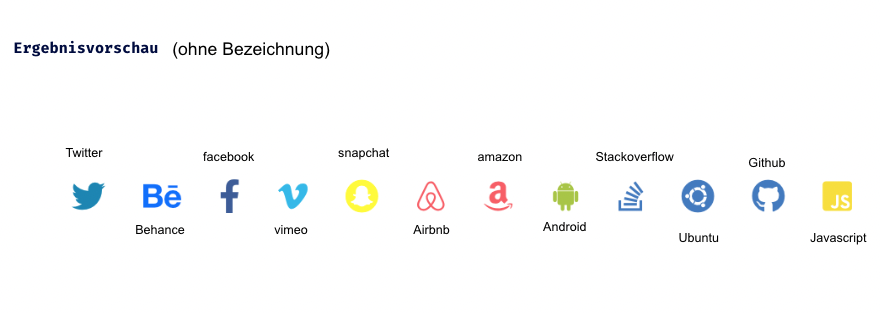

Lev1_1_css-extension-sass_variables-nesting

Eine Übung im SuperCode Bootcamp

## 🎓 Aufgabe

Aufgabenstellung

```

In dieser Übung lernen wir SASS Variables und Nesting kennen.

Verwende die Originalfarben für die Icons
Die Icons befinden sich auf der icon8 Website.


Verwende:
<link rel="stylesheet" href="https://maxst.icons8.com/vue-static/landings/line-awesome/line-awesome/1.3.0/css/line-awesome.min.css">


```

Das heutige Projekt ist ein Online-Shop. Die Tabelle im Classroom enthält alle Produktinformationen.

Verwende für das Layout CSS Flexbox. 😉

## 💡 Assets

```

Zusatz: Page ist komplett Responsive
```

## 📸 Screenshots



## 💻 Running

Zur Seite —> - [lev1_1: variables-nesting](https://jennijennina.github.io/SASSvariables-nesting)

<p align="left">
</p>

<h3 align="left">Languages and Tools:</h3>
<p align="left"> <a href="https://www.w3schools.com/html/" target="_blank" rel="noreferrer">  </a>
<a href="https://www.w3schools.com/css/" target="_blank" rel="noreferrer">  </a> 
<a href="https://www.w3schools.com/css/" target="_blank" rel="noreferrer">  </a> </p>
